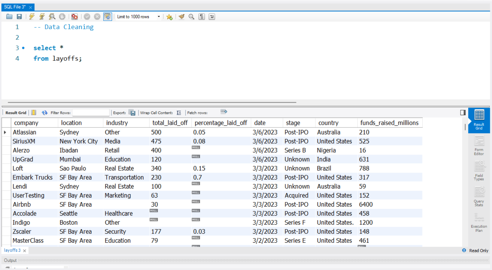

# SQL Data Cleaning Project

## Overview
This project showcases a complete data cleaning process using SQL in MySQL Workbench on a layoff dataset from global companies.

## Tools Used
- MySQL Workbench  
- SQL (CTEs, Window Functions, Joins,)

## Dataset
The dataset contains 2000+ layoff records from global companies. It was used to demonstrate practical data cleaning techniques.

## Objectives
- Remove duplicates  
- Standardize the Data 
- Fix Null values or blank values
- Prepare clean data for analysis

## Key Steps

### 1. Viewing Raw Data  

### 2. Identifying Null Values  

### 3. Removing Duplicates  

### 4. Final Cleaned Data  

## SQL Script
Find the complete SQL code in [SQL_Script.sql](./SQL_Script.sql)

## Learnings
- Writing clean, structured SQL  
- Using CTEs and Window Functions  
- Real-world data cleaning approach

## Author
**Anmol Kirtiwardhan**  
[LinkedIn](https://www.linkedin.com) • [Portfolio](https://your-portfolio.com)
